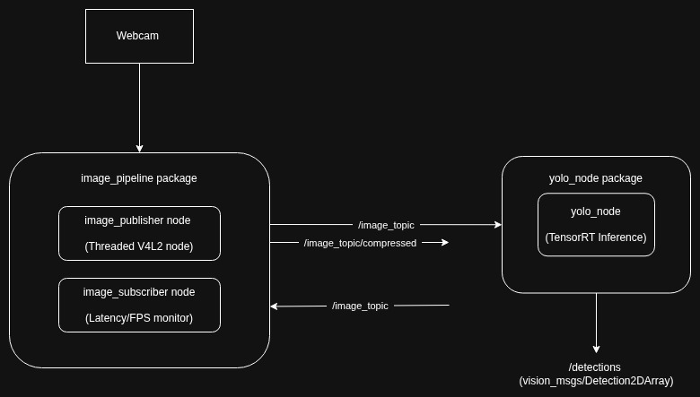
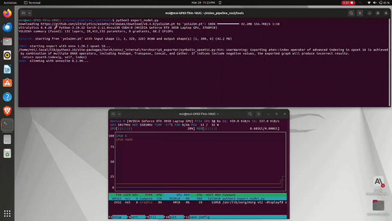
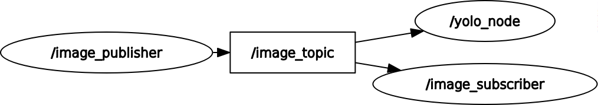

# MK2 Robot Vision: Real-Time YOLO26 ROS 2 Pipeline

A high-performance, deterministic object detection pipeline built for the **MK2 Autonomous Navigation Robot**, running **Ultralytics YOLO26** compiled to a **TensorRT FP16 engine** — benchmarked at **~14.57ms mean** / **~16.49ms P95 inference latency** on an RTX 3050 Laptop GPU over a clean ROS 2 pub/sub architecture.

> **Deployment Target:** Currently running on a development laptop (RTX 3050). Planned migration to **NVIDIA Jetson Orin Nano Super** for onboard autonomous operation.

---

## Why YOLO26?

  

[YOLO26](https://docs.ultralytics.com/models/yolo26/) is Ultralytics' latest-generation real-time detector (released January 2026), purpose-built for edge and robotics deployment. It's not just an incremental upgrade — it's an architectural rethink:

- **NMS-Free, End-to-End Inference** — eliminates Non-Maximum Suppression as a post-processing step entirely via a One-to-One detection head. What you train is exactly what you deploy. No manual IoU threshold tuning, no pipeline complexity.
- **DFL Removal** — Distribution Focal Loss is gone, which makes TensorRT and ONNX exports dramatically cleaner and more hardware-compatible. This was a key reason for choosing it for this project.
- **ProgLoss + STAL** — Progressive Loss Balancing and Small-Target-Aware Label Assignment improve small-object detection, critical for a robot operating in unstructured environments.
- **MuSGD Optimizer** — inspired by LLM training techniques for stable, fast convergence.

For a robot that needs **deterministic, low-latency inference** with **clean TensorRT exports**, YOLO26 is the right choice over YOLOv8/v11/v12.

---

## Model Progression: Nano → Small → Medium

This project went through a deliberate benchmarking progression, starting at the lightest variant and upgrading as GPU headroom allowed:

| Stage | Model | Format | Precision | Inference Latency (mean) | Confidence (mean)| Decision |
| :---: | :--- | :--- | :---: | :---- | :--- | :--- |
| 1 | `yolo26n` | `.pt` → `.engine` | FP16 | ~10.12ms | ~89.81% |High Throughput / Low Precision. Excellent speed, but rejected due to lower confidence stability in complex environments. |
| 2 | `yolo26s` | `.pt` → `.engine` | FP16 | **~14.57ms** ✅ | **~94.20%** ✅ |Optimal Balance. Selected as the **primary model**. Provides a ~5% confidence boost over Nano while maintaining a 50% timing buffer for the ROS 2 control loop. |
| 3 | `yolo26m` | `.pt` → `.engine` | FP16 | ~24.55ms | ~95.78% |High Precision / High Overhead. Peak accuracy, but rejected for real-time deployment as it consumes ~74% of the 30 FPS frame budget, risking jitter. |

Each `.pt` → `.engine` export was done with FP16 quantization via TensorRT (see `tools/export_model.py`). The Nano was the starting point — not because accuracy wasn't needed, but to understand the performance floor before committing to a heavier model.

> Avg confidence is measured on a controlled single-person scene (500+ post-warmup detections per model).

---

## Performance Benchmarks

| Model | Precision | Inference Latency (mean)| Inference Latency (P95) | Confidence (mean) | Architecture |
| :--- | :--- | :--- | :--- | :--- | :--- |
| YOLO26m | FP32 (PyTorch)  | ~82.08ms | ~82.65ms |~94.51% | NMS-Free, DFL-Free |
| YOLO26m | FP16 (TensorRT) | ~24.55ms | ~26.03ms |~95.78% | NMS-Free, DFL-Free |
| YOLO26s | FP16 (TensorRT) | ~14.57ms | ~16.49ms |~94.20% | NMS-Free, DFL-Free |
| YOLO26n | FP16 (TensorRT) | ~10.12ms | ~12.07ms |~89.81% | NMS-Free, DFL-Free |


> Benchmarked on: RTX 3050 Laptop GPU (4GB VRAM), Ubuntu 22.04, ROS 2 Humble, TensorRT 8.x, `imgsz=320`.
> FP16 TensorRT engines produce marginally higher confidence scores than PyTorch .pt weights due to FP16 arithmetic rounding in sigmoid activations — a known quantization effect, not a measurement error.

---

## System Architecture



### Packages & Nodes

**`image_pipeline`**

| Node | Role |
| :--- | :--- |
| `image_publisher` | Captures 320×240 MJPEG frames from V4L2 in a dedicated background thread. Publishes `sensor_msgs/Image` to `/image_topic` and conditionally publishes `CompressedImage` (JPEG q=80) only when subscribers are present. Monitors per-frame average brightness. |
| `image_subscriber` | Lightweight diagnostic node. Subscribes to `/image_topic` and logs **actual end-to-end latency** (message timestamp vs. receive time) and **real FPS** once per second. Used to validate the publisher's performance independently. |

**`yolo_node`**

| Node | Role |
| :--- | :--- |
| `yolo_detector` | Subscribes to `/image_topic` with `QoSProfile(depth=1)`. Runs YOLO26m.engine inference via Ultralytics API. Publishes structured `Detection2DArray` to `/detections`. Tracks inference latency and per-class detection confidence. Renders annotated bounding boxes in an OpenCV window. |

---

## Key Engineering Decisions

### 1. Threaded Camera Capture
The publisher separates capture from ROS publishing. A background thread continuously calls `cap.read()` (a blocking V4L2 operation), while the ROS timer callback reads the latest frame under a lock and publishes it. This means the ROS executor never blocks on camera I/O, and the pipeline never accumulates stale frames in memory.

### 2. QoS Depth = 1 (Drop-Oldest Policy)
The YOLO inference subscriber uses `QoSProfile(depth=1)`. If the GPU is busy when a new frame arrives, the queued frame is dropped in favour of the fresh one. For a navigation robot, a 100ms-old detection is worse than no detection.

### 3. Brightness Monitoring
Each frame's mean pixel value is computed via `np.mean(frame)`. If it falls below **100/255**, a ROS warning is emitted. The reasoning: in near-darkness, camera drivers may drop frames or inject heavy sensor noise. A robot acting on a false-negative detection (missed obstacle) in low light is a safety hazard.

### 4. Conditional Compressed Publishing
The publisher checks `get_subscription_count()` before JPEG-encoding frames. If no one is subscribed to `/image_topic/compressed`, the `cv2.imencode()` call is skipped entirely, saving CPU cycles that matter at the edge.

### 5. FP16 Quantization at Export
All models are exported from `.pt` to `.engine` with `half=True` at `imgsz=320`. FP16 halves VRAM usage and maximizes CUDA Tensor Core throughput on the RTX 3050 without meaningful accuracy regression for detection tasks.

### 6. Diagnostic Subscriber for Ground-Truth Latency
The `image_subscriber` node exists specifically to measure the publisher's actual performance. Rather than relying on ROS internal counters, it computes `current_time - msg.header.stamp` to get the true publish-to-receive latency, reported live every second.

### 7. Inference Latency Tracking with P95
The `YOLOLatencyTracker` class inside `yolo_detector.py` instruments every inference call using Ultralytics' internal `result.speed` dict, which breaks latency into three stages: `preprocess`, `inference`, and `postprocess`. These are more accurate than wrapping `model()` in `time.perf_counter()` because Ultralytics brackets each stage individually including CUDA synchronisation points.
 
Key design decisions in the tracker:
 
- **Warmup discard** — the first `WARMUP_FRAMES = 10` frames are silently dropped. TensorRT engines and PyTorch JIT both exhibit one-time compilation spikes on the first few frames; including them would distort the mean and P95.
- **Moving average** — a rolling window of the last 30 frames (`MOVING_AVG_WINDOW`) is printed on every frame for live monitoring without terminal noise.
- **Periodic full report** — every `REPORT_EVERY = 100` post-warmup frames, a full stats block prints: mean, P95, min, and max latency.
- **P95 over mean** — mean latency tells you the average case. P95 tells you what the navigation stack must be designed around: at 30 FPS, a P95 of 16.49ms means roughly 1 in 20 frames exceeds that threshold. A spike that only appears in the mean as a small bump can represent a missed navigation deadline at the worst moment.
- **Final stats on Ctrl+C** — `print_stats()` is called in the `finally` block of `main()`, guaranteeing a complete latency report is always printed on shutdown regardless of whether the `REPORT_EVERY` boundary was reached.
 
### 8. Per-Class Detection Confidence Tracking
The `ConfidenceTracker` class tracks mean detection confidence separately per class across frames, giving a fair and stable accuracy metric to compare across model variants.
 
Latency alone is an incomplete performance metric — it tells you how fast the model is, not how reliable its detections are. Confidence bridges that gap without requiring a full COCO evaluation run.
 
Key design decisions in the tracker:
 
- **Per-class, not per-frame** — a frame containing both a high-confidence person and a low-confidence chair would produce a misleading average if averaged together. Tracking per class means each object class has its own independent confidence history.
- **Shared warmup guard** — `ConfidenceTracker` applies the same `WARMUP_FRAMES` discard as `YOLOLatencyTracker`, keeping both trackers' sample counts in sync. This makes confidence and latency numbers directly comparable — both exclude the same early frames.
- **Empty frames not recorded** — a frame with zero detections is skipped entirely. An empty frame is not evidence of low confidence; it is evidence of no detection. Including it as a zero would corrupt the mean.
- **Frozen snapshot mechanism** — once a class accumulates `CONFIDENCE_SNAPSHOT_AT = 500` post-warmup detections, its mean confidence is frozen into `confidence_snapshots_` and printed with a `[SNAPSHOT]` label on every subsequent stats report. This snapshot is the benchmark value used in the README tables — stable enough at 500 samples that further frames will not meaningfully shift the mean. The live running mean continues printing alongside it for reference.
- **Alphabetical output** — classes are sorted alphabetically in the stats report for consistent output across runs, making side-by-side terminal comparisons easier when benchmarking multiple model variants.

---

## Project Structure

```
.
├── src/
│   ├── image_pipeline/
│   │   ├── image_pipeline/
│   │   │   ├── image_publisher.py     # Threaded V4L2 capture + ROS publisher
│   │   │   └── image_subscriber.py   # Latency/FPS diagnostic node
│   │   ├── package.xml
│   │   └── setup.py
│   └── yolo_node/
│       ├── yolo_node/
│       │   └── yolo_detector.py       # TensorRT YOLO26 inference node
│       ├── package.xml
│       └── setup.py
└── tools/
    └── export_model.py                # .pt → TensorRT .engine export script
```

---

## Getting Started

### Prerequisites

- ROS 2 Humble (Ubuntu 22.04)
- Python 3.10+
- NVIDIA GPU with CUDA + TensorRT installed
- `pip install ultralytics`
- ROS packages: `cv_bridge`, `vision_msgs`, `sensor_msgs`

### Step 1 — Export the Model to TensorRT

```bash
# Edit tools/export_model.py to select your model variant (n / s / m)
python3 tools/export_model.py
```

This produces a `.engine` file. Place it in your working directory or update the path in `yolo_detector.py`.

```python
# tools/export_model.py
from ultralytics import YOLO

model = YOLO('yolo26s.pt')  # swap for yolo26m.pt or yolo26n.pt
model.export(format='engine', device='0', half=True, imgsz=320, verbose=True)
```

### Step 2 — Build the Workspace

```bash
cd <your_ros2_ws>
colcon build --packages-select image_pipeline yolo_node
source install/setup.bash
```

### Step 3 — Run the Pipeline

```bash
# Terminal 1: Camera publisher
ros2 run image_pipeline image_publisher

# Terminal 2: YOLO inference
ros2 run yolo_node yolo_node

# Terminal 3 (optional): Latency/FPS diagnostics
ros2 run image_pipeline image_subscriber

# Terminal 4 (optional): GPU monitoring
nvtop
```

### Step 4 — Verify

```bash
ros2 topic list
# /image_topic
# /image_topic/compressed
# /detections

ros2 topic hz /detections          # Should report ~25-30 Hz
ros2 topic echo /detections        # Structured bounding box output
```

---

## Detections in Action

> *All recordings captured live: image_publisher + image_subscriber + yolo_node + nvtop + OpenCV bounding box window running simultaneously.*

### Model Comparison: Nano → Small → Medium

YOLO26n (TensorRT Engine, FP16)


YOLO26s (TensorRT Engine, FP16)


YOLO26m (TensorRT Engine, FP16)


### TensorRT Export Process



*`.pt` → `.engine` export with FP16 quantization using TensorRT*

### Full Pipeline Demo — YOLO26m


*4-terminal setup: image_publisher | image_subscriber | yolo_node | nvtop GPU monitor | OpenCV detection window with live bounding boxes on ~4-5 objects.*

---

## ROS 2 Node Graph



*Generated with `rqt_graph`. Run `rqt_graph` with all nodes active to regenerate.*

---

## Roadmap

- [ ] Add a unified launch file for the full pipeline
- [ ] Expose confidence threshold and target classes as ROS 2 parameters (currently hardcoded)
- [ ] Pipe `/detections` into the navigation / obstacle avoidance stack
- [ ] Build agentic AI reasoning layer on top of the detection pipeline (Ollama + local LLMs)
- [ ] Migrate camera publisher to Raspberry Pi 4 onboard the robot
- [ ] Evaluate INT8 quantization for further latency reduction on the laptop GPU

---

## Author

**Sreeraj V R** — Building the MK2 Autonomous Navigation Robot from scratch.

[](https://www.linkedin.com/in/YOUR_HANDLE)
[](https://github.com/YOUR_HANDLE)
