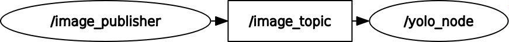

# MK2 Robot Vision: Real-Time YOLO26 ROS 2 Pipeline
A high-performance, deterministic vision pipeline built for the MK2 Autonomous Robot, leveraging **YOLO26** and **NVIDIA TensorRT** for sub-5ms inference.

## 🚀 Performance Benchmarks (RTX 3050 Laptop)
| Model | Precision | Inference Latency | System Features |
| :--- | :--- | :--- | :--- |
| **YOLO26m** | **FP16** | **4.4ms** | **NMS-Free, DFL-Free** |

## 🧠 Key Innovations
### 1. Intelligence-Over-Speed (Brightness Monitoring)
Unlike naive pipelines that force high FPS at the cost of image quality, this pipeline monitors **average pixel brightness**. 
- **The Logic:** In extremely low-light conditions where the camera driver might drop frames or introduce heavy noise, the system triggers a **Low-Light Warning**. 
- **The Philosophy:** A high-quality 15 FPS frame is more valuable for robot safety than a blurry, "noisy" 30 FPS frame that could lead to false negatives.

### 2. Hardware Optimized Deployment
The `tools/` directory contains custom scripts to bridge the gap between training and deployment:
- **Model Exporting:** Converts `.pt` weights into high-performance `.engine` files.
- **Quantization:** Implements **FP16 quantization** specifically tuned for the TensorRT execution provider to maximize the throughput of the RTX 3050 CUDA cores.

## 🏗 ROS 2 Node Architecture
This is a modular pipeline where each node handles a specific stage of the vision lifecycle:
- **`image_publisher`**: Handles V4L2 raw capture, brightness calculation, and health-status telemetry.
- **`yolo_inference_node`**: The core "brain" that loads the TensorRT engine and performs NMS-free detection.
- **`debug_viewer`**: (Optional) An optimized CV2 window for real-time visualization of bounding boxes.

## 📊 Node Graph (rqt_graph)

*Visualizing the high-throughput communication between the publisher and the inference engine.*

## 🎥 Detections in Action
| YOLO26m (Medium) | YOLO26s (Small) |
| :---: | :---: |
|  |  |
